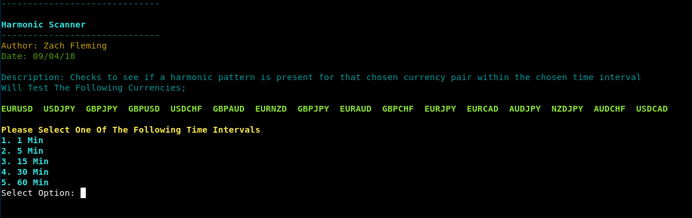
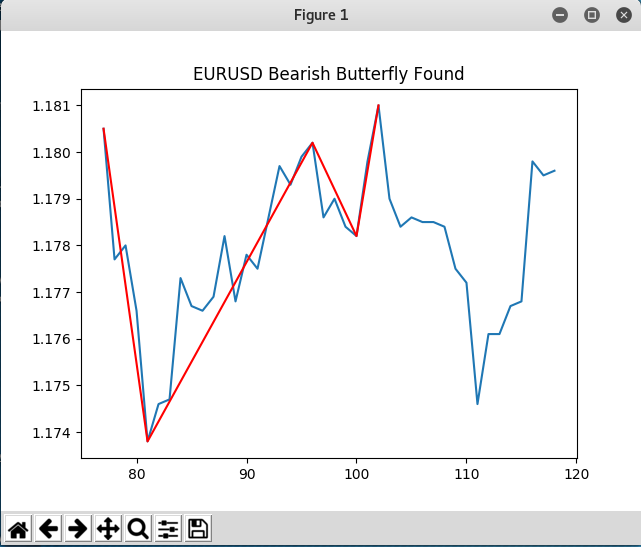

# Harmonic Scanner

### Description

Tool to check if a harmonic pattern exists in chosen currency and time interval.

### What Are Harmonics

Harmonic price patterns take geometric price patterns to the next level by using Fibonacci numbers to define precise turning points. Unlike other common trading methods, Harmonic trading attempts to predict future movements

Read more: Harmonic Patterns In The Currency Markets https://www.investopedia.com/articles/forex/11/harmonic-patterns-in-the-currency-markets.asp

### Launching the program

To use the program simply open up a terminal navigate to the directory and run it with "./master.py"

### How To / Program Features

The program has a list of harcoded currencies howevver these can be easily changed in in the code. 
The program also has a set deviation allowance from the strict Harmonic ratios. By default this is set to 15 percent. However this can also be changed my modifiying the err_allowance in graph_plotter.py

### Screenshots

### Built With

* Python 2.7.14

### Warning
Trade this at your own risk. This is not advice, just a project I decided to work on in free time. 

### Authors

*** Zach Fleming --> zflemingg1@gmail.com

